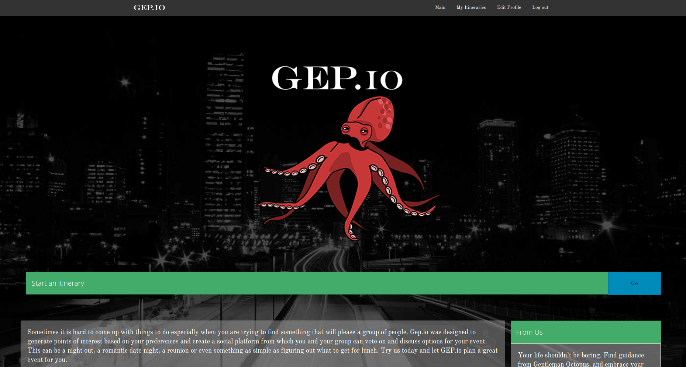

# gep.io


>Sometimes it is hard to come up with things to do especially when you are trying to find something that will please a group of people. Gep.io is designed to generate points of interest based on your preferences and create a social platform from which you and your group can vote on and discuss options for your event.

## Table of Contents

- [Usage](#usage)
- [Installation](#installation)
- [Roadmap](#roadmap)
- [Contributors](#contributors)

## Examples
### Demo

See a live version of the app [here](gep.io).

### Screenshot




## Usage

1. Login with Foursquare, Facebook or Google.
2. Set your user preferences in your profile.
3. Create an itinerary.
4. Follow through with your plan!

## Installation

1. Clone the repository

	```bash
	git clone https://github.com/etorkos/Spectaculum.git
	```
2.	Install dependencies

	```bash
	npm install    # installs node packages
	bower install  # installs bower dependencies
	```

__Note:__ If you encounter errors in the installation process for npm, it is recommended that you try running the install command with `sudo`

### Roadmap

#### Known bugs

- Votes may not update as desired on client pages.

## Contributors
* __Evan Torkos__ - Project Lead [LinkedIn](https://www.linkedin.com/profile/view?id=126096400) | [GitHub](https://github.com/etorkos)
* __Jan Bialostok__ - [LinkedIn](https://www.linkedin.com/profile/view?id=410773791) | [GitHub](https://github.com/janbialostok)
* __Xi Jin__ - Socketeer [LinkedIn](https://www.linkedin.com/profile/view?id=183110821) | [GitHub](https://github.com/bosonX)
* __Eric Gonzalo__ - [LinkedIn](https://www.linkedin.com/in/gonzaloe) | [GitHub](https://github.com/ersgonzalo)
